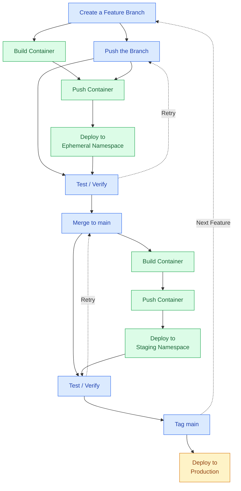

# learn [](https://drone.dxas90.xyz/dxas90/learn)

  
just to learn my stuff :)

### Binaries

[](https://github.com/dxas90/learn/releases) [](https://github.com/dxas90/learn/releases)


### Docker

[](https://hub.docker.com/r/dxas90/learn/) [](https://dxas90.work/pulls/dxas90)

```sh
oc new-app https://github.com/dxas90/learn.git
```

## What we want
```text
          Git Actions:                CI System Actions:

   +-------------------------+       +-----------------+
+-►| Create a Feature Branch |   +--►| Build Container |
|  +------------+------------+   |   +--------+--------+
|               |                |            |
|               |                |            |
|      +--------▼--------+       |    +-------▼--------+
|  +--►+ Push the Branch +-------+    | Push Container |
|  |   +--------+--------+            +-------+--------+
|  |            |                             |
|  |            |                             |
|  |     +------▼------+            +---------▼-----------+
|  +-----+ Test/Verify +◄-------+   | Deploy Container to |
|        +------+------+        |   | Ephemeral Namespace |
|               |               |   +---------+-----------+
|               |               |             |
|               |               +-------------+
|               |
|               |                    +-----------------+
|               |             +-----►| Build Container |
|      +--------▼--------+    |      +--------+--------+
|  +--►+ Merge to main   +----+               |
|  |   +--------+--------+                    |
|  |            |                     +-------▼--------+
|  |            |                     | Push Container |
|  |     +------▼------+              +-------+--------+
|  +-----+ Test/Verify +◄------+              |
|        +------+------+       |              |
|               |              |    +---------▼-----------+
|               |              |    | Deploy Container to |
|               |              |    | Staging   Namespace |
|               |              |    +---------+-----------+
|               |              |              |
|               |              +--------------+
|               |
|        +------▼-----+             +---------------------+
+--------+ Tag main   +------------►| Deploy Container to |
         +------------+             |     Production      |
                                    +---------------------+
```



```text
  Create Branch ──┬──> Build Container
                  │
  Push ──────┬────┼──> Push Container -> Deploy Ephemeral
             │    │                            │
             └──> Test/Verify <────────────────┘
                       │
                  Merge to main
                       │
                       ├──> Build Container -> Push Container -> Deploy Staging
                       │                                            │
                       └──> Test/Verify <───────────────────────────┘
                                  │
                             Tag main -> Deploy Production
```

### LICENCE


